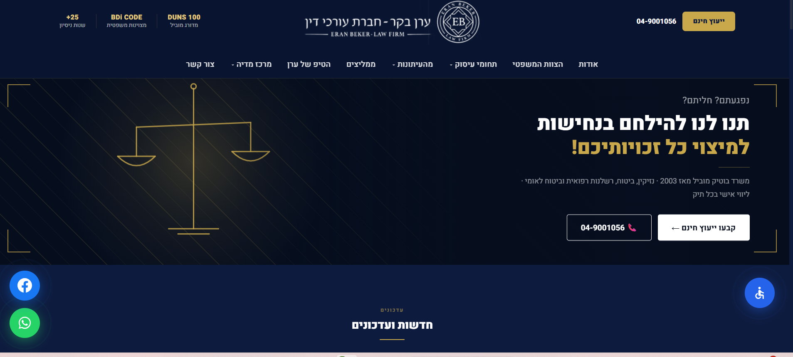
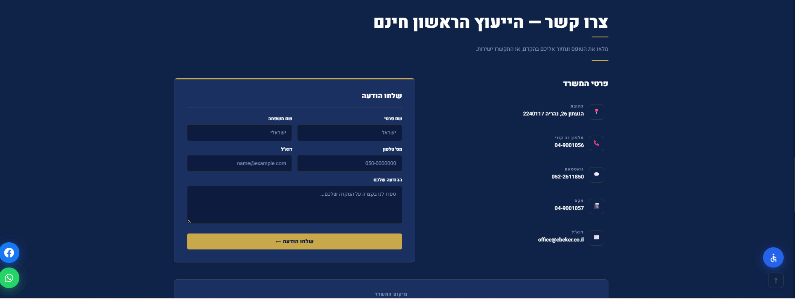
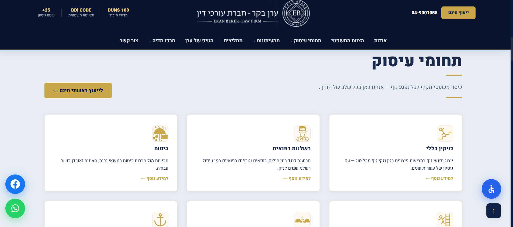
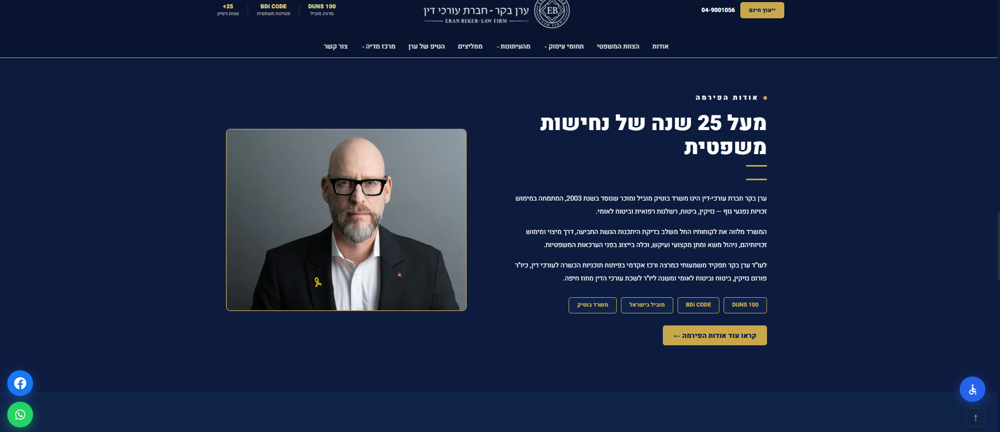

# Eran Beker — Law Firm Website

**A polished, fully-Hebrew (RTL) marketing & client-intake site for one of Israel's leading personal-injury litigators.** Designed and built solo, end to end. Live, in production, and built as a real lead-generation tool — not a template.

🔗 **Live:** [ebeker.vercel.app](https://ebeker.vercel.app/)
🔒 *Source is private (client work). This README is a case study — screenshots below.*









---

## The client

Eran Beker runs a leading Israeli law firm specializing in personal injury, medical malpractice, insurance, and national-insurance claims — a **DUNS 100** and **BDi-rated** practice with 25+ years of work. The site had to look the part: credible, premium, and trustworthy enough that a prospective client hands over a serious case.

---

## What it actually does

This isn't a brochure — it's a **working lead-capture machine**, which is what a law firm is really buying.

- **The intake form genuinely submits.** On submit it sends the lead to the firm by email (via EmailJS, no server required) *and* opens WhatsApp pre-filled with the inquiry, so the prospect can reach the firm through whichever channel they prefer. The user sees a clean confirmation state on success.
- **Conversion is built into every screen** — click-to-call links in the navbar, hero, footer, and every practice page; a floating WhatsApp button; a dismissible sticky contact bar that appears on scroll; an embedded office map; and "free consultation" CTAs throughout.
- **14 practice areas**, each with substantial original Hebrew legal copy and its own detail page — so the site ranks and converts across the firm's full range of work, not just a generic homepage.

---

## Craft highlights

The details that separate a shipped product from a template:

- **Custom canvas hero animation** — a hand-written `requestAnimationFrame` loop rendering gold diagonal lines and a swinging scales-of-justice with a radial glow. DPR-aware, cleaned up on unmount. No animation library — built from scratch.
- **A real accessibility toolkit** — font-size scaling, high-contrast / invert / grayscale modes, link highlighting, a readable-font toggle, stop-animations, and a large-cursor mode, all persisted across visits, plus a dedicated accessibility statement page. (Accessibility compliance is a genuine requirement for Israeli business sites — this isn't decorative.)
- **Fully RTL Hebrew** — set at the document level, RTL-native typography (Heebo), proper layout throughout.
- **Polished interaction design** — scroll-reveal animations, animated stat counters, an auto-advancing touch-swipeable testimonials carousel, hover-intent navbar dropdowns, a scroll-shrink navbar, image-gallery modals with zoom, and a scroll-progress bar.
- **Performance pipeline** — a `sharp`-based image-optimization script outputs resized `.webp`/`.avif`; the map iframe is lazy-loaded.

---

## Tech stack

| Layer | Choice |
|---|---|
| **Framework** | React 18 (SPA) + React Router |
| **Build** | Vite |
| **Styling** | Hand-written CSS (~3,600 lines) with CSS custom properties — no framework |
| **Lead capture** | EmailJS (client-side email) + WhatsApp deep-link |
| **Media** | `sharp` image optimization, `ffmpeg` video thumbnails (build-time scripts) |
| **Analytics** | Google Analytics with SPA route-change tracking |
| **Fonts / icons** | Google Fonts (Heebo); all icons hand-inlined SVG |
| **Deploy** | Vercel (Netlify-ready config also present) |

**Scope:** ~6,300 lines of JSX across ~46 React files + 2 custom hooks, ~27 routed pages, a homepage with 8 major sections, custom animation, and a full a11y system.

---

## Honest engineering notes

What I'd refine before/after handover (being straight about it):

- **SEO metadata is the main gap.** Because it's a single-page React app, every route currently shares one `<title>` and meta description, and there's no Open Graph, schema.org `LegalService`/`Attorney` markup, or sitemap. For a firm that depends on search visibility, adding per-page titles + structured data is the highest-value next step.
- **Favicon** is still the framework default — a quick swap to the firm's logo.
- **The form has no spam protection** (captcha/honeypot) — fine at current volume, worth adding if it gets scraped.
- The `server/` folder is an older local-only backend (Express + SQLite). **It is not deployed** and nothing in the site calls it; the production form runs entirely on EmailJS. The `/admin` page that talked to it was removed in the audit branch (it pointed at `http://localhost:3002` and had no authentication).

I'd rather list these than pretend a shipped site is flawless — knowing what to polish next is part of the job.

---

## Deployment notes (Vercel)

`vercel.json` holds redirects from old Wix URLs, security headers and cache headers.

**Content-Security-Policy** is currently sent as `Content-Security-Policy-Report-Only`, so a
mistake can't break production. To switch to enforcing:

1. Deploy, then browse the site with DevTools open (home page with the form submitted, `/media/tv`
   with a YouTube video, `/media/radio` playing an MP3, the map) and check the console for
   `[Report Only]` CSP violations.
2. Add any missing origin to the matching directive in `vercel.json`.
3. Rename the header key to `Content-Security-Policy` and redeploy.

`music.wixstatic.com` is in `media-src` only until the radio MP3s are self-hosted under `public/audio/`.

## Running it

​```bash
npm install
npm run dev       # Vite dev server
npm run build     # production build → dist/
npm run preview   # serve the build
​```

The front-end needs no runtime env vars. Build-time scripts: `node scripts/optimize-images.mjs`, `node scripts/generate-video-thumbnails.mjs`.

---

<sub>Designed and built solo — design, copy structure, animation, and lead-capture — using Claude Code.</sub>
